# User manual

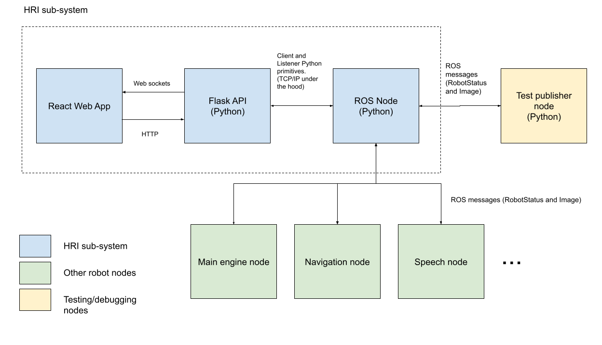

The system is composed of the following sections:

* **HRI sub-system:** This is what will be covered in this docs.
	* **1. React Web App:** Front end were data received from the robot is displayed in a user friendly way.
	* **2. Flask API:** Intermediary between ROS Nodes and React Frontend.
	* **3. ROS Node:** ROS Node that subscribes to topics that publish robot data.
* **Other robot nodes:** These nodes are part of the system of the robot. E.g:
	* Main engine node
	* Navigation Node
	* Speech node
* **Test publisher:** This component consists of a node publishing mock data for the ROS Node Listener to receive.

## React Web App

This module is implemented using a React JS. The UI is quite simple, it consists of a series of modular components. A component purpose is to display data from the robot in a user friendly way.

<div class="text-center" id="img_1_0">
  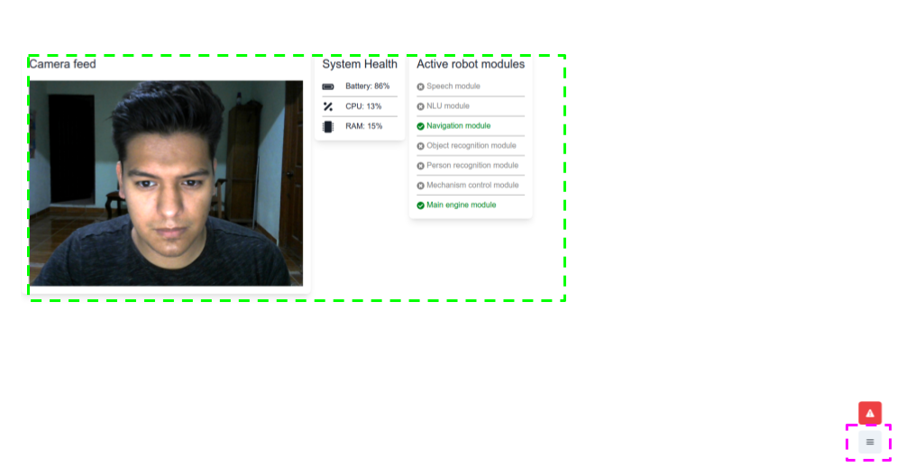
  <p class="small">Image 1.0 Main UI view</p class="small">
</div>

In the green enclosed area of [Image 1.0](#img_1_0) the user can find example of components:

* Camera Feed
* System Health
* Active Robot Modules

In the pink enclosed area of [Image 1.0](#img_1_0) the user can find a button to open the [Configuration Drawer](#configuration-drawer).

### Configuration Drawer

In the configuration drawer the user can perform the following actions:

* [Activating components](#activating-components)
* [Select a configuration](#select-a-configuration)
* [Create a configuration](#create-a-configuration)
* [Edit a configuration](#edit-a-configuration)

<div class="text-center" id="img_1_1">
  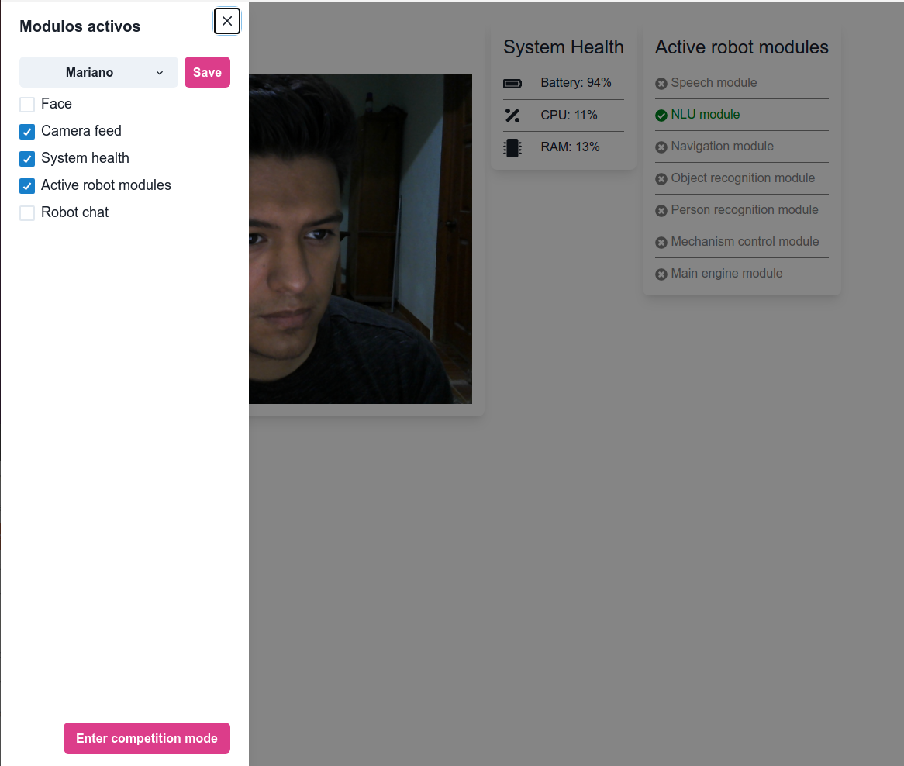
  <p class="small">Image 1.1 Configuration Drawer</p class="small">
</div>

#### Activating components

In the collapsed drawer that can be seen in [Image 1.1](#img_1_1), the user can find a checkbox for each [implemented component](#examples). All components that are checked are displayed in the GUI.

To activate or deactivate a module the user has to check the respective checkbox.

#### Select a configuration

In the configuration drawer ([Image 1.1](#img_1_1)) the user can find a dropdown menu button, when collapsed will display a series of options ([Image 1.2](#img_1_2)).

<div class="text-center" id="img_1_2">
  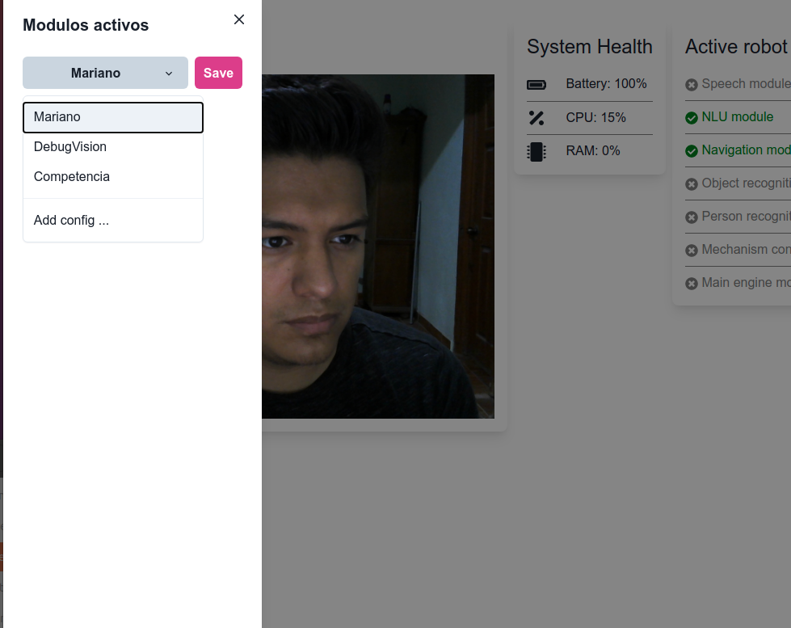
  <p class="small">Image 1.2 Configuration Selection</p class="small">
</div>

In the dropdown content displayed in [Image 1.2](!img_1_2) the user can find a list of current available configurations, [the user can create configurations](#create-a-configuration).

When the user selects a configuration the GUI will refresh and display the modules that are part of the selected configuration.

#### Create a configuration

<div class="text-center" id="img_1_3">
  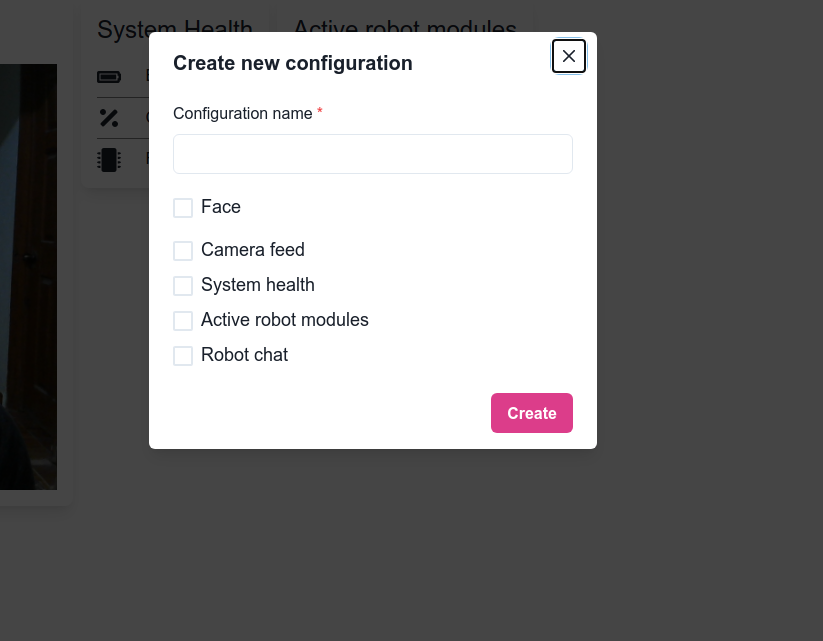
  <p class="small">Image 1.3 Create a configuration</p class="small">
</div>


At the bottom of the dropdown content ([Image 1.2](#img_1_2)) displays a button for adding a config, when clicked a modal with a form for creating a config will be displayed ([Image 1.3](#img_1_3)).

Provide a name for the configuration and check the modules that are part of the configuration and then click the create button.

After this the new configuration will be [available for selection](#select-a-configuration).

### Edit a configuration

When a configuration is selected it can be edited by modifying the activated modules. As we can observe in [Image 1.1](#img_1_1) the current configuration is Mariano and it has 3 active modules, by checking/unchecking modules the user can modify the configuration.

When the user is done modifying the configuration it can be saved by clicking the Save button enclosed by the configuration selection dropdown ([Image 1.1](#img_1_1)). After clicking the configuration will be updated.

### Components

In the [main UI view](#img_1_0) the user can find examples of components.

A component must have an specific purpose, [examples](#examples) are:

* [Camera Feed](#camera-feed): Displays camera feed received from the robot.
* [System Health](#system-health): Displays information about battery, cpu and ram usage.
* [Active Robot Modules](#active-robot-modules): Displays current active robot modules.

The following code is how a template component template looks like:


```js
import { Box, Text } from "@chakra-ui/layout";
import React, { useState, useEffect } from "react";
import { socket } from "../services/socketConnection";

export default function ComponentTemplate() {
  // State variables used for component with initial state as null.
  const [var, setVar] = useState(null);

  // Use effect for receiving robot socket messages.
  useEffect(() => {
    socket.on("ComponentTemplate", setVar);
    return () => socket.off("ComponentTemplate");
  }, []);

  return (
    <Box shadow="lg" p="4" borderRadius="lg" maxW="600px">
      <Text fontSize="2xl" mb="4">
        Hello World! {var}
      </Text>
    </Box>
  );
}
```

***The purpose of a component is to display information received from the robot in a user friendly way. Because of this, it is essential to establish a communication channel with the robot.***

Components are stored in [this directory](https://github.com/AYM1607/AtHomeHRI/tree/main/src/components).

The code underlined in green defines a state variable, the useState method returns a variable and a function call to set the variable, when this function is called the component will render again showing changes made by the variable.
This variable purpose is to contain the information that is going to be displayed in the component.
(More about react state variables at: https://es.reactjs.org/docs/hooks-state.html )

The code underlined in yellow uses a useEffect hook, that is going to execute the code block every time a message is received through the socket, this socket is used to receive messages from the Flask API.
(More about react use effect hook at: https://es.reactjs.org/docs/hooks-effect.html )

The code underlined in blue defines the content of the component using JSX, the example shows a simple Hello World. Note that the var can be used in the content to display the information.
(More about jsx at: https://es.reactjs.org/docs/introducing-jsx.html )


#### Examples

The following components are currently implemented:

* Robot Face
* Camera Feed
* System Health
* Robot Chat
* Active Robot Modules

##### RobotFace

The robot face is an interactive set of eyes (Image 1.6) that display emotions, this can be used as a way to interact with the robot that is familiar to humans. 


<p class="text-center small">Image 1.4 Neutral Robot Face</p>

The code can be found [here](https://github.com/AYM1607/AtHomeHRI/tree/main/src/components/RobotFace).

The face can display the following emotions:

* Happy
* Sad
* Angry
* Focused
* Confused


<p class="text-center small">Image 1.5 Happy Robot Face</p>

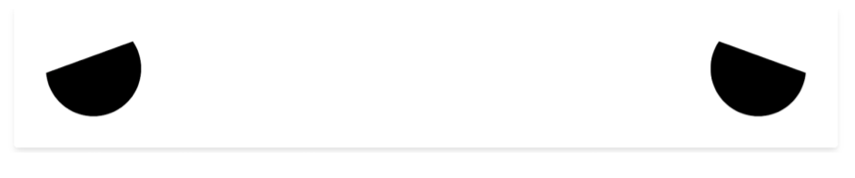
<p class="text-center small">Image 1.6 Sad Robot Face</p>

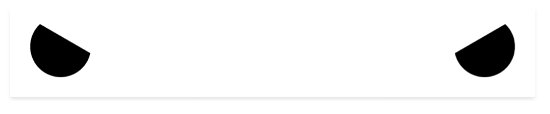
<p class="text-center small">Image 1.7 Angry Robot Face</p>

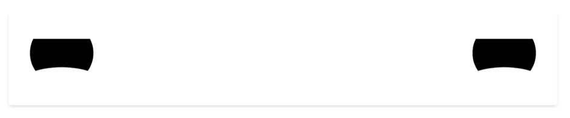
<p class="text-center small">Image 1.8 Focused Robot Face</p>


<p class="text-center small">Image 1.9 Confused Robot Face</p>

The idea is that the user defines the emotion response depending on what the robot is doing. The component receives the emotion through a socket using a hook:

```js 
  useEffect(() => {
    socket.on("RobotFace", setEmotion);
    return () => socket.off("RobotFace");
  }, []);
```

For example:

* **Confused:** This emotion can be sent to the component when the Robot did not understand an instruction.
* **Focused:** This emotion can be sent when the Robot understands the current instruction.
* **Angry:** This emotion can be sent when the Robot bumped into an obstacle.
* **Happy:** This emotion can be sent when the Robot receives a compliment.

Essentially the user defines what situations correspond to an emotion, this is sent from a ROS Node which is then read by the Flask API, this API ultimately sends it to the UI via sockets.
This is a great tool for debug, because it is very simple to understand and is user defined.

It also supports two more settings:
start: The robot will start blinking
stop: The robot will stop blinking

##### Camera Feed

<div class="text-center">
	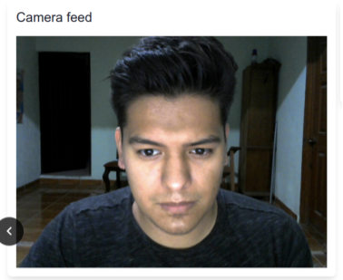
	<p class="small">Image 2.0 Camera Feed Component</p class="small">
</div>

This component displays the camera feed that the robot sends through the system.
The code can be found [here](https://github.com/AYM1607/AtHomeHRI/blob/main/src/components/CameraFeed.js).

The image is received through the socket:
```js
  useEffect(() => {
    socket.on("CameraFeed", setImage);
    return () => socket.off("CameraFeed");
  }, []);
```

Then it is displayed in the HTML content of the component: 
```js
  return (
    <Box shadow="lg" p="4" borderRadius="lg" maxW="600px">
      <Text fontSize="2xl" mb="4">
        Camera feed
      </Text>
      {image && }
    </Box>
  );
```

##### System Health

This component displays data about system health from the robot.

<div class="text-center" id="img_1_x">
	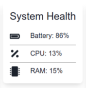
	<p class="small">Image 2.1 System Health Component</p class="small">
</div>

For now it displays the following information:

* Battery
* CPU
* RAM

More types of data can be added, the code can be found [here](https://github.com/AYM1607/AtHomeHRI/blob/main/src/components/SystemHealthModule.js).

The data is received from the robot:

```js
  useEffect(() => {
    socket.on(SocketChannels.SYSTEM_HEALTH, (data) =>
      setSystemHealth(JSON.parse(data))
    );
    return () => socket.off(SocketChannels.ACTIVE_MODULES);
  }, []);
```

And then it is used to display it a user friendly way:

```js
return (
    <Box shadow="lg" p="4" borderRadius="lg" maxW="600px">
      <Text fontSize="2xl" mb="4">
        System Health
      </Text>
      <VStack divider={<StackDivider borderColor="gray" />} alignItems="start">
        <Box>
          <Icon boxSize="1.5em" mr="5" as={FaBatteryFull} /> Battery:{" "}
          {parseInt(systemHealth[0])}%
        </Box>
        <Box>
          <Icon boxSize="1.5em" mr="5" as={FaPercentage} /> CPU:{" "}
          {parseInt(systemHealth[1])}%
        </Box>
        <Box>
          <Icon boxSize="1.5em" mr="5" as={FaMicrochip} /> RAM:{" "}
          {parseInt(systemHealth[2])}%
        </Box>
      </VStack>
    </Box>
    );
```

##### Robot Chat

This component was implemented using [React Chatbox component](https://www.npmjs.com/package/react-chatbox-component), its functionality is to send and receive text messages to or from the robot.

<div class="text-center">
	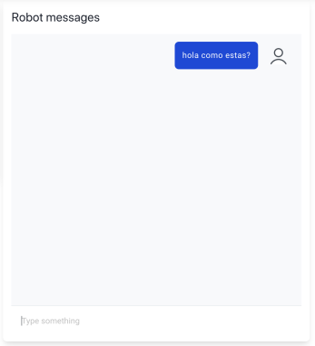
	<p class="small">Image 2.2 Robot Chat component</p class="small">
</div>

Message history is stored in the browser local storage.

Messages are received from the robot through the socket:

```js
  useEffect(() => {
    socket.on("RobotMessage", setNewMessage);
    return () => socket.off("RobotMessage");
  }, []);

  const storedMessages = getLocalStorageRobotChat();

  if (newMessage != null && !messageExists(newMessage.id, storedMessages)) {
    console.log("New Message: ", newMessage);

    storedMessages.push(newMessage);
    setLocalStorageRobotChat(storedMessages);
  }
```

When a message is received it is verified that it hasn't been received yet, then it is stored in the history and the Chatbox component renders all messages:

```js
  return (
    <Box borderRadius="lg" p="4" shadow="lg" w="600px">
      <Text fontSize="2xl" mb="4">
        Robot messages
      </Text>
      <ChatBox messages={storedMessages} user={user} onSubmit={sendMessage} />
    </Box>
  );
```

When the user sends a message using the Chatbox component, this message is stored in the history and then it can be sent to the robot using the HRI system by sending a POST request to the Flask API.
This input can be used as raw input for the robot.

```js
  function sendMessage(message) {
    const newMessage = {
      text: message,
      id: uuidv4(),
      sender: {
        uid: user.uid,
        avatar: "https://img.icons8.com/cotton/2x/gender-neutral-user--v2.png",
      },
    };

    // TODO: Add post to python API that communicates with ROS Node
    // to send instruction.

    setNewMessage(newMessage);
  }
```

##### Active Robot Modules

This component displays which modules from the robot are currently active.

<div class="text-center">
	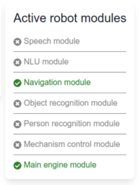
	<p class="small">Image 2.3 Active Robot Modules component</p class="small">
</div>

The code can be found [here](https://github.com/AYM1607/AtHomeHRI/blob/main/src/components/RobotModulesModule.js).

The data is received from the robot through the socket:

```js
  useEffect(() => {
    socket.on(SocketChannels.ACTIVE_MODULES, (data) =>
      setActiveRobotModules(JSON.parse(data))
    );
    return () => socket.off(SocketChannels.ACTIVE_MODULES);
  }, []);
```

Then the data is displayed in a friendly way:

```js
  return (
    <Box shadow="lg" p="4" borderRadius="lg" maxW="600px">
      <Text fontSize="2xl" mb="4">
        Active robot modules
      </Text>
      <VStack divider={<StackDivider borderColor="gray" />} alignItems="start">
        {Object.values(RobotModule).map((robotModule) => {
          const active = activeRobotModulesMap[robotModule];
          return (
            <Box key={robotModule} color={active ? "green" : "gray"}>
              {active ? (
                <Icon as={FaCheckCircle} />
              ) : (
                <Icon as={FaTimesCircle} />
              )}{" "}
              {mapRobotModuleToName(robotModule)}
            </Box>
          );
        })}
      </VStack>
    </Box>
  );
```

#### Creating a component

Creating a component is possible by following two simple steps:

* Adding a template
* Adding mapping methods and includes

Note that following these steps will only implement the component in the Web App (frontend). It is still necessary to implement the [backend part](#implementing-new-component-backend), this consists of data collection and sending.

##### Adding a template

This step consists of adding the component React JSX file under [this directory](https://github.com/AYM1607/AtHomeHRI/tree/main/src/components).

A barebone component looks like this:

```js
import { Box, Text } from "@chakra-ui/layout";
import React, { useState, useEffect } from "react";
import { socket } from "../services/socketConnection";

export default function ComponentTemplate() {
  // State variables used for component with initial state as null.
  const [variable, setVariable] = useState(null);

  // Use effect for receiving robot socket messages.
  useEffect(() => {
    socket.on("ComponentTemplate", setVariable);
    return () => socket.off("ComponentTemplate");
  }, []);

  return (
    <Box shadow="lg" p="4" borderRadius="lg" maxW="600px">
      <Text fontSize="2xl" mb="4">
        Hello World! {variable}
      </Text>
    </Box>
  );
}
```

*ComponentTemplate* has to be substituted with the name of your component.

Setup receiving messages through the socket in the appropiate channel (backend sending messages still has to be implemented):
```js
  // Use effect for receiving robot socket messages.
  useEffect(() => {
    socket.on("ComponentTemplate", setVar);
    return () => socket.off("ComponentTemplate");
  }, []);
```

And then design the structure of the component:

```js
  return (
    <Box shadow="lg" p="4" borderRadius="lg" maxW="600px">
      <Text fontSize="2xl" mb="4">
        Hello World! {variable}
      </Text>
    </Box>
  );
```

##### Adding mapping methods and includes

For the component to display in the UI and configuration drawer it has to included in couple of files.

All components are refered to using an enum called [ModuleIdentifier](https://github.com/AYM1607/AtHomeHRI/blob/main/src/lib/enums.js#L1).

The component name has to be added the following way:

```js
export const ModuleIdentifier = {
  FACE: "face_module",
  CAMERA: "camera_module",
  SYSTEM_HEALTH: "system_health_module",
  ROBOT_MODULES: "robot_modules",
  CHAT: "chat_module",
  NEW_COMPONENT_NAME: "new_component_name"
};
```

In the [util library](https://github.com/AYM1607/AtHomeHRI/blob/main/src/lib/util.js) are located a couple of methods that provide the interface to display components in the UI.

In this file we have to include our component template:
```js
import CameraFeed from "../components/CameraFeed";
import RobotChat from "../components/RobotChat";
import RobotFace from "../components/RobotFace/RobotFace";
import SystemHealthModule from "../components/SystemHealthModule";
import RobotModulesModule from "../components/RobotModulesModule";
import NewComponentName from "../components/NewComponentName";
```

Inside this library we can find two methods mapping methods that we have to add our new component:

###### **[mapModuleIdToComponent](https://github.com/AYM1607/AtHomeHRI/blob/main/src/lib/util.js#L10)**

This method maps the module Id (enum value) to the React component, the component has to be added the following way:

```js
export function mapModuleIdToComponent(moduleId) {
  switch (moduleId) {
    case ModuleIdentifier.CAMERA:
      return <CameraFeed />;
    case ModuleIdentifier.CHAT:
      return <RobotChat />;
    case ModuleIdentifier.FACE:
      return <RobotFace />;
    case ModuleIdentifier.SYSTEM_HEALTH:
      // TODO: implement system health.
      return <SystemHealthModule />;
    case ModuleIdentifier.NEW_COMPONENT_NAME:
      return <NewComponentName />;
    case ModuleIdentifier.ROBOT_MODULE
    default:
      // Return an empty div if the value is not recognized.
      return <div />;
  }
}
```

If the module id is not handled an empty div will be returned.

###### **[mapModuleIdToName](https://github.com/AYM1607/AtHomeHRI/blob/main/src/lib/util.js#L29)**


This method is for displaying the name of the component in the UI, it maps the module id to the name.

The component has to be added the following way:

```js
export function mapModuleIdToName(moduleId) {
  switch (moduleId) {
    case ModuleIdentifier.CAMERA:
      return "Camera feed";
    case ModuleIdentifier.CHAT:
      return "Robot chat";
    case ModuleIdentifier.FACE:
      return "Face";
    case ModuleIdentifier.SYSTEM_HEALTH:
      return "System health";
    case ModuleIdentifier.NEW_COMPONENT_NAME:
      return "NewComponentName";
    default:
      return "Unknown module";
  }
}
```

If the module id is not handled "Unknown module" will be shown as name.

## Flask API

The Flask API consists of the following modules:

* **[Sockets](#sockets):** SocketIO library is used to establish communication and send messages to the [React Web App](#react-web-app)
* **[Web endpoints](#web-endpoints):** This can be get or post depending on the needs and can be used to send messages from the [React Web App](#react-web-app) to [ROS Node](#ros-node)
* **[Connection to ROS Node](#connection-to-ros-node):** Full duplex connection with [ROS Node](#ros-node).

The code can be found [here](https://github.com/RoBorregos/robocup-home/blob/feature/HRISetup/catkin_home/src/hri/scripts/flask_server.py).

This API works as intermediary between the frontend and backend because there is no direct way that both can communicate because of how ROS works.

### Sockets

The purpose of this module is to send the collected data to the [React Web App](#react-web-app). The data is not created at this point, it is received from the ROS Node using the [TCP/IP server](#connection-to-ros-node).

When data is [received](https://github.com/RoBorregos/robocup-home/blob/feature/HRISetup/catkin_home/src/hri/scripts/flask_server.py#L41) it is only redirected to the frontend using SocketIO:

```python
    channel = message["channel"]
    value = message["value"]
    socketio.emit(
        channel,
        value if type(value) == str else json.dumps(value)
    )
```

### Web endpoints

A user can implement an endpoint in the flask server for receiving web data from the UI. e.g. the [stop](https://github.com/RoBorregos/robocup-home/blob/feature/HRISetup/catkin_home/src/hri/scripts/flask_server.py#L97) endpoint:

```python
@app.route("/stop", methods=["POST"])
def stop_robot():
    global ros_sender
    ros_sender.send("shutdown")
    return jsonify({"message": "Robot was shutdown"})
```

Then the programmer can define what to do with the data, like sending it to the ROS Node using the [TCP/IP client](#connection-to-ros-node).

### Connection to ROS Node

This is possible by using a TCP/IP server and client in both the Flask API and ROS Node, so that both modules can send and receive data.

In the following [piece of code](https://github.com/RoBorregos/robocup-home/blob/feature/HRISetup/catkin_home/src/hri/scripts/flask_server.py#L41) received messages are handled:

```python
# Decode messages and send them to the appropriate socket channel.
def ros_receive_handler():
    while True:
        if ros_receiver is None:
            # Avoid blocking the process before initialization.
            socketio.sleep(0.01)
            continue
        # Only call `recv` when we're sure there's a new message since
        # it is a blocking call.
        if ros_receiver.poll():
            try:
                message = ros_receiver.recv()
            except:
                # Ignore message if there was an exception.
                # TODO: We should not do this becuase we could
                # loose critical messages.
                rospy.loginfo("There was an exception")
                continue

            if message == "CreateSender":
                initialize_ros_sender()
            elif message == "Close":
                cleanup()
            else:
                channel = message["channel"]
                value = message["value"]
                socketio.emit(
                    channel,
                    value if type(value) == str else json.dumps(value)
                )
        else:
            # Only throttle if there are no available messages.
            socketio.sleep(0.01)

```

Note that when a message that needs to be sent to the UI is received it is done using [sockets](#sockets).

Messages can be sent to using [```ros_sender```](https://github.com/RoBorregos/robocup-home/blob/feature/HRISetup/catkin_home/src/hri/scripts/flask_server.py#L28).

Example in the ```/stop``` endpoint:

```python
@app.route("/stop", methods=["POST"])
def stop_robot():
    global ros_sender
    ros_sender.send("shutdown")
    return jsonify({"message": "Robot was shutdown"})
```

When anything is posted to this endpoint a shutdown signal is sent to ROS Node using the client. This needs to be handled by the ROS Node appropriately.

## ROS Node

This module consists of a ROS Node called hri. The code can be found [here](https://github.com/RoBorregos/robocup-home/blob/feature/HRISetup/catkin_home/src/hri/scripts/main.py).
The purpose of this node is to listen to messages published to topics related to debugging and then send the data to the [flask API](#flask-api) using the TCP/IP client so that it can be sent ultimately to the [React Web App](#react-web-app).

Currently the node is subscribing to the following topics:

* [Robot Info](#robot-info)
* [Robot Video Feed](#robot-video-feed)

### Robot Info

Subscription is made to topic ```/robot_info``` ([source](https://github.com/RoBorregos/robocup-home/blob/feature/HRISetup/catkin_home/src/hri/scripts/main.py#L127)) where [RobotStatus](https://github.com/RoBorregos/robocup-home/blob/b72130f379d77607e7c0fdbea30677b9a5b20196/catkin_home/src/hri/msg/RobotStatus.msg) messages are published.
The structure of RobotStatus:

```
Header header
string[] ActionQueue
float32[3] SystemHealth
string RobotStatus
string[] ActiveModules
string RobotMessage
string RobotFace
```

The following code executes when a new RobotStatus is received:

```python
def robot_info_receive_handler(robot_status):
    if server_sender is not None:
        for channel in channels:
            try:
                server_sender.send({
                    "channel": channel,
                    "value": getattr(robot_status, channel)
                })
            except:
                print("Error fetching: ", channel)
```

Where [channels](https://github.com/RoBorregos/robocup-home/blob/feature/HRISetup/catkin_home/src/hri/scripts/main.py#L16) is defined as:

```python
channels = [
    "ActionQueue",
    "SystemHealth",
    "RobotStatus",
    "ActiveModules",
    "RobotMessage",
    "RobotFace"
]
```

Note that channels content is the same as the data names defined for RobotStatus, this name must also match the channel name used when listening to the socket, because it will be used also for sending through the socket.
Sending is made by the [flask server](#flask-api).

[Example](https://github.com/AYM1607/AtHomeHRI/blob/main/src/components/SystemHealthModule.js#L11) of receiving through the socket:

```js
  useEffect(() => {
    socket.on(SocketChannels.SYSTEM_HEALTH, (data) =>
      setSystemHealth(JSON.parse(data))
    );
    return () => socket.off(SocketChannels.SYSTEM_HEALTH);
  }, []);

...

export const SocketChannels = {
  SYSTEM_HEALTH: "SystemHealth",
  ACTIVE_MODULES: "ActiveModules",
};

```

Note that SystemHealth matches the name used by the ROS Node from channels and RobotStatus message.


### Robot Video Feed

Subscription is made to topic ```/robot_video_feed``` ([source](https://github.com/RoBorregos/robocup-home/blob/feature/HRISetup/catkin_home/src/hri/scripts/main.py#L129)) where Video messages are published.

This was implemented as a different topic than ```/robot_info``` so that video feed can be handled independently from simple debug data. 

The following [code](https://github.com/RoBorregos/robocup-home/blob/feature/HRISetup/catkin_home/src/hri/scripts/main.py#L94) executes when a new video feed is published:

```python
def robot_video_feed_receive_handler(image_msg):
    if server_sender is not None:
        img = bridge.imgmsg_to_cv2(image_msg, desired_encoding="passthrough")
        _, img_buffer = cv2.imencode('.jpg', img)
        img_text = base64.b64encode(img_buffer)
        server_sender.send({
            "channel": "CameraFeed",
            "value": img_text.decode("ascii")
        })
```
It is then sent to the [Flask API](#flask-api) so that it can be sent ultimately to the [React Web App](#react-web-app).

[Example](https://github.com/AYM1607/AtHomeHRI/blob/main/src/components/CameraFeed.js#L9) of this message being used in the UI:

```js
export default function CameraFeed() {
  const [image, setImage] = useState(null);

  useEffect(() => {
    socket.on("CameraFeed", setImage);
    return () => socket.off("CameraFeed");
  }, []);

  return (
    <Box shadow="lg" p="4" borderRadius="lg" maxW="600px">
      <Text fontSize="2xl" mb="4">
        Camera feed
      </Text>
      {image && }
    </Box>
  );
}
```
Note that ```'CameraFeed'``` is being used to listen for image feed using the socket.
Mote at [Camera Feed](#camera-feed).


### Test Node Publisher

This module is not part of the system but is used to test it and show an example on how to collect and send data to the UI.

The code can be found [here](https://github.com/RoBorregos/robocup-home/blob/feature/HRISetup/catkin_home/src/hri/scripts/test_publisher.py).

This module consists of a ROS Node called ```test_hri_publisher``` that publishes to two topics:

* ```/robot_info```
* ```/robot_video_feed```

The same flow must be followed to publish messages for the UI to show, but collected data must be real and where, when and why it is published is determined by the user.

#### Robot Info

The following is executed periodically publishing to ```/robot_info```.

```python
def status_publisher():
    rospy.loginfo("Starting status publisher")
    info_pub = rospy.Publisher("/robot_info", RobotStatus, queue_size=10)
    rate = rospy.Rate(1/3)
    try:
        while not rospy.is_shutdown():
            # Publish robot status.
            message = RobotStatus()
            # Set active modules.
            active_robot_modules = []
            for module in robot_modules:
                if bool(random.getrandbits(1)):
                    active_robot_modules.append(module)
            message.ActiveModules = active_robot_modules
            # Set system health.
            message.SystemHealth = [
                # Battery.
                float(85 + int(random.getrandbits(4))),
                # CPU.
                float(random.getrandbits(4)),
                # RAM.
                float(random.getrandbits(4)),
            ]
            # TODO: add values to the rest of the message.
            info_pub.publish(message)
            rate.sleep()
    except:
        pass
```

Remembering RobotStatus structure:

```
Header header
string[] ActionQueue
float32[3] SystemHealth
string RobotStatus
string[] ActiveModules
string RobotMessage
string RobotFace
```

ActiveModules field is an array of the currently active robot modules from the following list:

```
robot_modules = [
    "speech",
    "nlu",
    "navigation",
    "object_recognition",
    "person_recognition",
    "mechanism_control",
    "main_engine"
]
```
The test publisher randomly select robot modules to be markes as active in the UI. This is then sent to the [Flask API](#flask-api) to be redirected to the UI using sockets.

In [this component](#active-robot-modules) an example of how the data obtained through the socket is used to render the active modules in a user friendly way.

The case of SystemHealth can also be found in the test publisher. This field is defined as an array of floats of size 3, and it is also filled with random data:

```python
    # Set system health.
    message.SystemHealth = [
        # Battery.
        float(85 + int(random.getrandbits(4))),
        # CPU.
        float(random.getrandbits(4)),
        # RAM.
        float(random.getrandbits(4)),
    ]
```

This data is then sent to the UI through the system and used in the [System Health Component](#system-health)


#### Robot Video Feed

This publisher reads from the camera using open cv and then publishes it to ```robot_video_feed``` topic.


```python
def video_publisher():
    rospy.loginfo("Starting video publisher")
    image_pub = rospy.Publisher("/robot_video_feed", Image, queue_size=10)
    rate = rospy.Rate(10)
    try:
        while not rospy.is_shutdown():
            # Publish video feed.
            _, img = vid.read()
            image_message = bridge.cv2_to_imgmsg(img, encoding="passthrough")
            image_pub.publish(image_message)
            rate.sleep()
    except:
        pass
```  

Then it is received by the ROS Node listener and sent to the UI through the [Flask Api](#flask-api). 

Example of how this data is used can be found in the [Camera Feed Component](#camera-feed).

### Implementing new component backend

This consists of setting up data collection, and setting up the channel to send it.

It can be possible by doing this simple stesps:

1. Adding new field to [RobotStatus](https://github.com/RoBorregos/robocup-home/blob/feature/HRISetup/catkin_home/src/hri/msg/RobotStatus.msg) message. More info about supported datatypes [here](http://wiki.ros.org/msg#Fields).
2. Adding new field name to ```channels``` [here](https://github.com/RoBorregos/robocup-home/blob/feature/HRISetup/catkin_home/src/hri/scripts/main.py#L16).
3. Collecting real time data and publishing it to ```/robot_info``` so that it can be sent by the [ROS Node](#ros-node) to the [Flask API](#flask-api) and ultimately to the [React Web App](#react-web-app).

This implements only the backend, to setup the front end check out: [Creating a component](#creating-a-component)